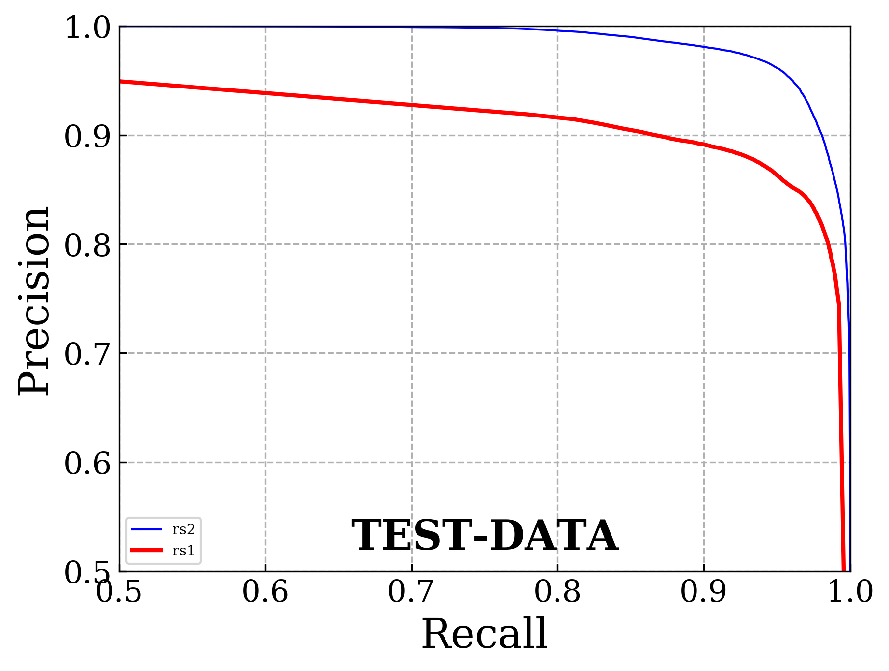
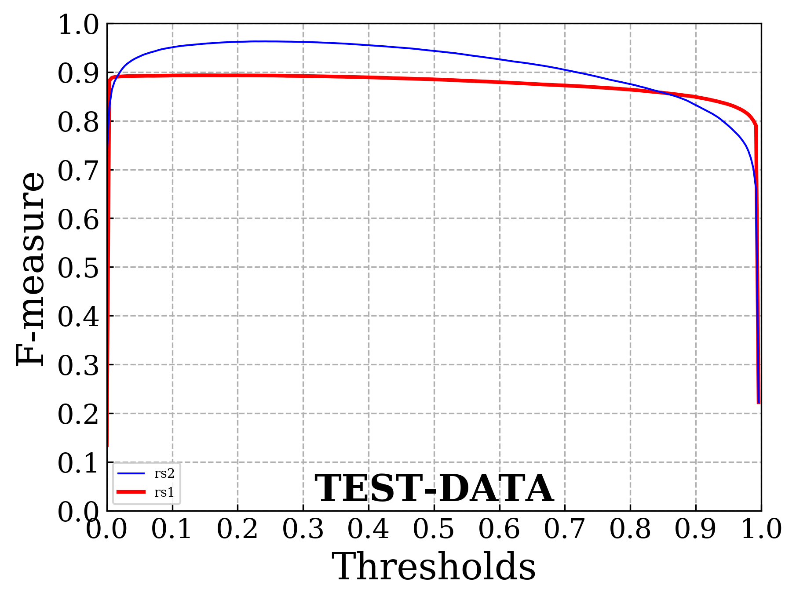

# Binary-Segmentation-Evaluation-Tool
This repo is developed for the evaluation of binary image segmentation results.

The Code was used for evaluation in CVPR 2019 paper '[*BASNet: Boundary-Aware Salient Object Detection*](http://openaccess.thecvf.com/content_CVPR_2019/html/Qin_BASNet_Boundary-Aware_Salient_Object_Detection_CVPR_2019_paper.html) [code](https://github.com/NathanUA/BASNet)', [Xuebin Qin](https://webdocs.cs.ualberta.ca/~xuebin/), Zichen Zhang, Chenyang Huang, Chao Gao, Masood Dehghan and Martin Jagersand.

__Contact__: xuebin[at]ualberta[dot]ca

## Required libraries

Python 3.6.6 (version newer than 3.0)
numpy 1.15.2
scikit-image 0.14.0
matplotlib 2.2.3

## Implemented measures

1. MAE Mean Absolute Error 
2. Precision, Recall, F-measure (This a python implementation of the matlab code [sal_eval_toolbox](https://github.com/ArcherFMY/sal_eval_toolbox))
3. Precision-recall curves

4. F-measure curves 


## Future measures 

IoU Intersection-over-Union
relax boundary F-measure
...

## Usage 

Please follow the scripts in ```quan_eval_demo.py```

## Citation
```
@InProceedings{Qin_2019_CVPR,
author = {Qin, Xuebin and Zhang, Zichen and Huang, Chenyang and Gao, Chao and Dehghan, Masood and Jagersand, Martin},
title = {BASNet: Boundary-Aware Salient Object Detection},
booktitle = {The IEEE Conference on Computer Vision and Pattern Recognition (CVPR)},
month = {June},
year = {2019}
}
```
